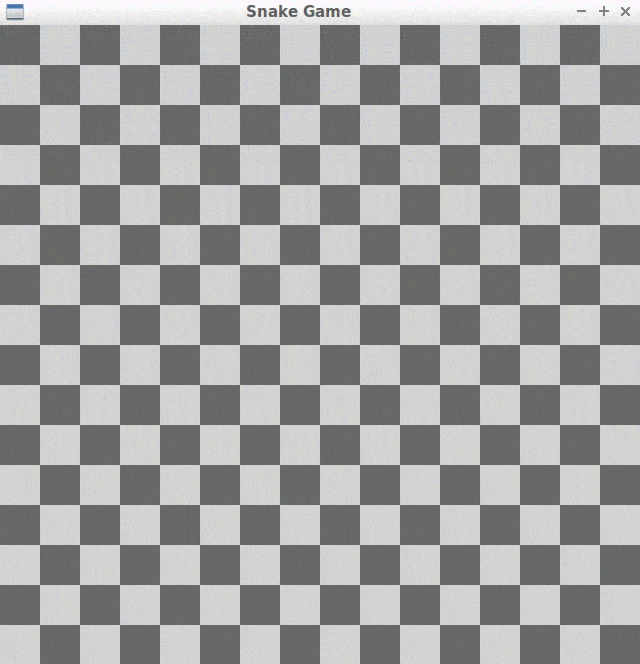
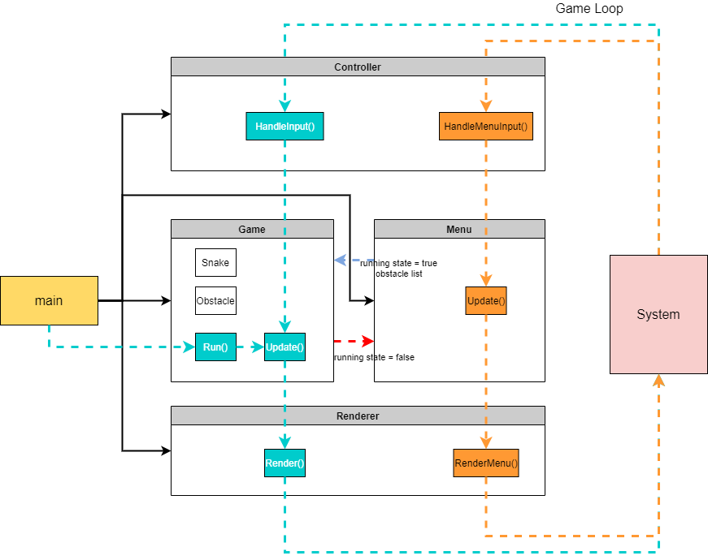

# Capstone Project: Enhanced Snake Game

This Repo uses the Starter Code of the [Udacity C++ Nanodegree Program](https://www.udacity.com/course/c-plus-plus-nanodegree--nd213) and adds new features to the game. Features include bug fixes, a startscreen/menu, the ability to create a custom obstacle "map" and an option to restart the game without launching the program again. 


The Project was extended by a new Menu Object located in the files `menu.h` and `menu.cpp`. Furthermore, a new `Obstacle` class was created within `snake.cpp` and `snake.h` to accomodate new user-created obstacles. The instructions and dependencies haven't changed. 



## Gameplay and Controls

Basic gameplay consists of the snake being controlled by the arrow keys. However a new  gameplay element was added - the placement of obstacles in the map. Obstacles can be added by the player before the game starts to make the game more challenging. This is done by  by left clicking a square to mark it. This can also be undone by clicking the marked square once again. Pressing `Y` on the keyboard starts a new game while pressing `X` during the game brings the player back to the Obstacle Selection. Pressing `X` during Obstacle Selection quits the game.


## Dependencies for Running Locally
* cmake >= 3.7
  * All OSes: [click here for installation instructions](https://cmake.org/install/)
* make >= 4.1 (Linux, Mac), 3.81 (Windows)
  * Linux: make is installed by default on most Linux distros
  * Mac: [install Xcode command line tools to get make](https://developer.apple.com/xcode/features/)
  * Windows: [Click here for installation instructions](http://gnuwin32.sourceforge.net/packages/make.htm)
* SDL2 >= 2.0
  * All installation instructions can be found [here](https://wiki.libsdl.org/Installation)
  * Note that for Linux, an `apt` or `apt-get` installation is preferred to building from source.
* gcc/g++ >= 5.4
  * Linux: gcc / g++ is installed by default on most Linux distros
  * Mac: same deal as make - [install Xcode command line tools](https://developer.apple.com/xcode/features/)
  * Windows: recommend using [MinGW](http://www.mingw.org/)

## Basic Build Instructions

1. Clone this repo.
2. Make a build directory in the top level directory: `mkdir build && cd build`
3. Compile: `cmake .. && make`
4. Run it: `./SnakeGame`.

## Addressed Rubric Points
Below is a list of Rubric Points and how each one was addressed in the program. 

1. **The project demonstrates an understanding of C++ functions and control structures.**
2. **The project accepts user input and processes the input.**

Line 52-82 of `controller.cpp` shows how both points were addressed. The player is able to
select Squares as game obstacles. Basically user input is being handled and stored in a vector.
 ```c++
// This member function handles user input during the "menu" phase of \
the program. 
bool Controller::HandleMenuInput(std::vector <SDL_Point> &obstacles) {
  SDL_Event e;
  while (SDL_PollEvent(&e)) {
  if (e.type == SDL_KEYDOWN) {
    switch (e.key.keysym.sym) {

      case SDLK_y:
        return false;
        break;

      case SDLK_x:
        exit(0);
        break;
    }
  }
  //If the mouse button is pressed the current location of the cursor is \
  searched within the obstacles vector. If it isn't found it is being added \
  else it is erased (unselecting the cell) providing only unique cells. 
  if (e.type == SDL_MOUSEBUTTONDOWN ) {

  SDL_Point val { e.motion.x/((long unsigned int)screen_width/grid_width), e.motion.y/((long unsigned int)screen_height/grid_height)};
  std::vector<SDL_Point>::iterator it;
  it = std::find(obstacles.begin(), obstacles.end(), val);

  if (it == obstacles.end() || obstacles.size() == 0 )
    obstacles.push_back(val);
 
  else
    obstacles.erase(it);
 
    }
  }
  return true;
}

```

3. **The project uses Object Oriented Programming techniques.**
4. **Classes use appropriate access specifiers for class members.**
This was addressed by the creation of new `menu` and `obstacle` Objects as well as by the extention of classes by new member functions.  
&nbsp;

5. **Class constructors utilize member initialization lists.**
6. **The project makes use of references in function declarations.**

An example of this can be seen in Line 12-15 in `menu.h`:

```c++
class Menu {
    public:
        Menu(Renderer & renderer, Controller & controller):
        renderer(renderer), controller(controller) {}
```
